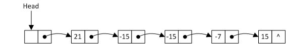
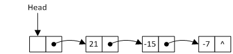

# README

## 题目描述

用单链表保存$m$个整数，结点结构为：\[data][link]，且|data|$≤n$（$n$为正整数），现要求设计一个算法，对于链表中data的绝对值相等的结点，仅保留第一次出现的结点而删除其余绝对值相等的结点。请给出该算法的C语言实现。
例如，给定单链表Head如下：



删除结点后的Head为：




## 输入说明

每次输入包含一个测试样例。对于每个测试样例，第一行包含两个正整数$m$和$n$。其中$m$表示单链表保存的整数个数，$n$表示data绝对值上限。下一行包含$m$个整数，中间用空格分开。输入保证整数的绝对值不大于$n$。


## 输出说明

对于每个测试样例，在第一行中按顺序输出原链表中的所有整数，中间用空格分开。在第二行中按顺序输出删除绝对值相等结点后的链表中的所有整数。


## 输入样例

```
5 30
21 -15 -15 -7 15
```


## 输出样例

```
Original link: 21 -15 -15 -7 15
Deleted link: 21 -15 -7
```
