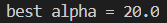

<center><font face="黑体" size="20">聚丙烯熔融指数数据预测</font>


<center>
    <font face="楷体" size="5">姓名：欧翌昕</font>
</center>

<center>
    <font face="楷体" size="5">专业：软件工程</font>
</center>

<center>
    <font face="楷体" size="5">学号：3190104783</font>
</center>

<center>
    <font face="楷体" size="5">课程名称：软件技术基础</font>
</center>

<center>
    <font face="楷体" size="5">指导老师：刘兴高</font>
</center>


<center>
    </font><font face="黑体" size="5">2020~2021秋冬学期 2021 年 1 月 20 日</font>
</center>

---

## 一、摘要

​		实时预测聚丙烯熔融指数是工业上一个重要的问题，一款具有较高准确度的聚丙烯熔融指数数据实时预测软件将具有很广阔的市场前景。本文作者先从问题背景入手，对业界需求以及项目可行性进行了分析，中间部分将本文用到的算法及其原理进行了简要的分析，最后将多元线性回归算法、岭回归算法、高斯过程回归算法应用于根据生产中与熔融指数相关的可直接测量的操作变量预测聚丙烯熔融指数的过程，并对各个模型的训练结果进行了对比。最终得到通过高斯过程回归的训练结果达到了0.999的拟合优度，准确率高，可以满足实时预测聚丙烯熔融指数的需求。


## 二、绪论

### 2.1 问题背景

​		聚丙烯作为工业三大塑料之一，在各个领域有着广泛的应用。我国自80年代初开始引进大批生产装置，聚丙烯的产量迅速增长。目前面临加入WTO后国外大型企业投资建厂的竞争，国内的聚丙烯生产企业急需增加生产能力，提高产品质量，研究开发高附加值的新牌号，而作为牌号划分重要指标的熔融指数(MI)难以在线测量，从而导致生产质量的控制品质大大降低。因此在实际生产中， 熔融指数的测定需要依靠测得的其他参数进行拟合，如何拟合得到聚丙烯熔融指数，实时监测生产过程成了工业上的一个重要问题。

### 2.2 需求分析

​		聚丙烯熔融指数与工业生产息息相关，而限于当下的技术水平，对聚丙烯熔融指数的实时测量又迟迟不能做到。在这种情况下，一款具有较高准确度的聚丙烯熔融指数数据实时预测软件的出现就能弥补聚丙烯工厂对其的刚性需求，因此这款程序完成后也具有广阔的市场前景。

### 2.3 数据来源与说明

​		聚丙烯生产过程熔融指数数据，共 150 组时序数据，见 excel 表格。

​		生产中与熔融指数相关的可直接测量的操作变量为excel 表格中的变量 x，共 9 个。y为可供训练或验证的熔融指数真实值。

### 2.4 可行性分析

​		聚丙烯熔融指数数据的预测需要应用人工智能相关知识和操作。本程序需要Python 作为主要编程语言，应用 sklearn 库的中进行人工智能相关函数的调用、利用 NumPy 库进行数值相关操作利用 Pandas 库来进行读入 excel 文件的相关操作；对于提供的数据集进行训练集和测试集的分类，从而检验程序的拟合程度。得益于网络上丰富的开源资源，sklearn 、Pandas 等库详细的官方文档，以及快捷方便的IDE（VSCode），本人是可以在规定时间内掌握上述技术要求并且独立完成这款程序的。


## 三、多元回归分析理论综述

### 3.1 回归分析定义

​		回归分析（Regression Analysis）是一种统计学上分析数据的方法，目的在于了解两个或多个变量间是否相关、相关方向与强度，并建立数学模型以便观察特定变量来预测研究者感兴趣的变量。更具体的来说，回归分析可以帮助人们了解在只有一个自变量变化时因变量的变化量。一般来说，通过回归分析我们可以由给出的自变量估计因变量的条件期望。回归分析是建立因变数  Y（或称依变数，反应变数）与自变数 X（或称独变数，解释变数）之间关系的模型。

​		当影响因变量的因素是多个时候，这种一个变量同时与多个变量的回归问题就是多元回归，分为多元线性回归和多元非线性回归。线性回归(Linear regressions)和逻辑回归(Logistic regressions)是人们学习算法的第一个预测模型。因此它们很常见，还有许多分析人员认为它们是仅有的回归模型，部分分析师认为它们是所有回归模型中最重要的。 事实上有无数的回归模型都能被使用，每种形式的回归模型都有它独特且重要的应用场景。

### 3.2 线性回归介绍

​		线性回归是利用数理统计中的回归分析，来确定两种或两种以上变量相互依赖的定量关系的一种统计分析方法。其表达形式为：
$$
y=w'x+e
$$


​		其中$e$为误差服从均值为0的正太分布。回归分析中，只包括一个自变量和一个因变量，且二者关系可以用一条直线表示，这种回归分析称为一元线性回归分析。如果回归分析包括两个或两个以上自变量，且因变量和自变量之间是线性关系，则称为多元线性回归分析。

​		线性回归属于回归问题。对于回归问题，解决流程为：

- 给定数据集中每个样本及其正确答案，选择一个函数模型$h$(hypothesis，假设)。
- 为$h$找到适应数据（未必是全局）的最优解，即找出最优解下$h$的参数。
- 给定的数据集取名叫做训练集（Training Set），不能拿所有数据来训练，要保留一部分数据来验证模型。

### 3.3 多元线性回归(Linear Regression)算法

​		在回归分析中，如果有两个或两个以上的自变量，就称为多元回归。事实上，一种现象常常是与多个因素相联系的，由多个自变量的最优组合共同来预测或估计因变量，比只用一个自变量进行预测或估计更有效，更符合实际。

​		多元线性回归中最常用的方法为普通最小二乘法，目标值$y$输入变量$x$的线性组合，数学公式表示如下：
$$
\hat{y}(w,x)=w_0+w_1x_1+\cdots+w_px_p
$$
​		若将所有变量包括因变量都先转化为标准分，再进行线性回归，此时得到的回归系数就能反映对应自变量的重要程度。这时的回归方程称为标准回归方程，回归系数称为标准回归系数，表示如下：
$$
Z_y=\beta_1Z\cdot1+\beta_2Z\cdot2_\cdots+\beta_kZ\cdot k
$$
​		对于普通最小二乘的系数估计问题，其依赖于模型各项的相互独立性。当各项是相关的，且设计矩阵的各列近似线性相关，那么，设计矩阵会趋向于奇异矩阵，这种特性导致最小二乘估计对于随机误差非常敏感，可能产生很大的方差。

### 3.4 岭回归(Ridge Regression)算法

​		为了防止模型的过拟合，我们在建立线性模型的时候经常需要加入正则化项。一般有L1正则化和L2正则化。线性回归的L2正则化通常称为Ridge回归，它和一般线性回归的区别是在损失函数上增加了一个L2正则化的项。

​		L2范数是各参数的平方再求平方根：
$$
||\theta||_2=\sqrt{\sum^m_{i=1}\theta_i^2}
$$
​		L2范数不使每一个元素都为0，而是接近于0。L2范数通过使权重衰减，进而使得特征对于总体的影响减小而起到防过拟合的作用。L2 的优点在于求解稳定、快速。

​		具体Ridge回归的损失函数表达式如下：
$$
J(\theta)=\frac{1}{2}(X\theta-Y)^T(X\theta-Y)+\frac{1}{2}\alpha||\theta||_2^2
$$
​		其中α为常数系数，需要进行调优。Ridge回归的求解比较简单，一般用最小二乘法。

### 3.5 高斯过程回归(Gaussian Process Regression)算法

​		高斯过程回归(Gaussian Process Regression, GPR)是使用高斯过程(Gaussian Process, GP)先验对数据进行回归分析的非参数模型（non-parameteric model）。

​		GPR的模型假设包括噪声（回归残差）和高斯过程先验两部分，其求解按贝叶斯推断(Bayesian inference)进行。若不限制核函数的形式，GPR在理论上是紧致空间(compact space)内任意连续函数的通用近似(universal approximator)。此外，GPR可提供预测结果的后验，且在似然为正态分布时，该后验具有解析形式。因此，GPR是一个具有泛用性和可解析性的概率模型。


## 四、建模情况和结果分析

### 4.1 模型评价标准

#### 4.1.1 均方误差

​		均方误差（mean-square error, MSE）是反映估计量与被估计量之间差异程度的一种度量。

​		在样本量一定时，评价一个点估计的好坏标准使用的指标总是点估计$\hat{\theta}$与参数真值$\theta$ 的距离的函数，最常用的函数是距离的平方，由于估计量$\hat{\theta}$具有随机性，可以对该函数求期望，这就是下式给出的均方误差：
$$
MSE(\hat{\theta})=E(\hat{\theta}-\theta)^2
$$

#### 4.1.2 拟合优度

​		拟合优度（Goodness of Fit）是指回归直线对观测值的拟合程度。度量拟合优度的统计量是可决系数（亦称确定系数）$R^2$。$R^2$最大值为1。$R^2$的值越接近1，说明回归直线对观测值的拟合程度越好；反之，$R^2$的值越小，说明回归直线对观测值的拟合程度越差。

​	$R^2$衡量的是回归方程整体的拟合度，是表达因变量与所有自变量之间的总体关系。$R^2$等于回归平方和在总平方和中所占的比率，即回归方程所能解释的因变量变异性的百分比。实际值与平均值的总误差中，回归误差与剩余误差是此消彼长的关系。因而回归误差从正面测定线性模型的拟合优度，剩余误差则从反面来判定线性模型的拟合优度。

### 4.2 数据的描述统计

#### 4.2.1 数据特征值统计信息


#### 4.2.2 数据的缺失值检验


​		由上述结果可知，数据中不存在缺失值。

#### 4.2.3 数据相关性举证


#### 4.2.4 数据可视化输出

​		建立散点图来看数据里的数据分析情况以及数据线性情况，将使用seaborn包的pariplot()方法来绘制三种不同因素对标签的影响。

​		通过加入一个参数kind='reg'，seaborn可以添加一条最佳拟合直线和一个95%的置信带。


​		通过上图，不同因素对熔融指数的预测线（置信度为95%），也可大致看出不同的特征值对于标签值的影响与相关关系。

### 4.3 训练集和测试集

​		使用sklearn.model_selection.train_test_split()函数来创建训练集和测试集。

```python
x_train, x_test, y_train, y_test = train_test_split(x, y, train_size=0.75, random_state=10,stratify=None)
```

​		样本特征值：(150, 9)  训练特征值：(112, 9)   测试特征值：(38, 9)

​		样本标签值：(150, )    训练标签值：(112, )     测试标签值：(38, )

### 4.4 训练结果分析

#### 4.4.1 多元线性回归

​		使用sklearn.linear_model.LinearRegression实例的fit()方法对训练集进行训练，从而得到回归系数和截距。

```python
reg = LinearRegression()
```

​		回归系数矩阵为：


​		截距项为：


​		拟合优度为：


​		均方误差为：


​		预测值与真实值之间的对比：


#### 4.4.2 岭回归

​		通过RidgeCV可以设置多个参数值，算法使用交叉验证获取最佳参数值。

```python
reg = RidgeCV(alphas=[0.1, 1.0, 10.0, 15.0, 20.0, 25.0, 30.0])
```

​		回归系数矩阵为：


​		最佳参数值为：



​		拟合优度为：


​		均方误差为：


​		预测值与真实值之间的对比：


#### 4.4.3 高斯过程回归

```python
kernel = C(1.0, (1e-3, 1e3)) * RBF(10, (1e-2, 1e2))
reg = GaussianProcessRegressor(kernel=kernel, n_restarts_optimizer=9)
```

​		拟合优度为：


​		均方误差为：


​		预测值与真实值之间的对比：


## 五、总结与展望

​		在该程序的输出中 ，吻合度主要是由两个参数来衡量的分别为拟合优度和均方误差。实际上，这两个数据值都与训练样本数量有关，训练样本越大，拟合优度会越高 ，均方误差会越小 。由于拿到的数据样本不足、线性度不够好等硬性等缺陷，导致数据的相关指数还是比较低。

​		通过对比多元线性回归算法、岭回归算法和高斯过程回归算法的训练结果可以发现，多元线性回归算法和岭回归算法的拟合优度均在0.55左右，而高斯过程回归算法的拟合优度十分接近1，效果非常好。究其原因，多元线性回归算法和岭回归算法本质上都属于线性回归，而数据样本不足、线性度不够好，或者可能并不满足线性关系，最终导致这两种模型的训练结果很差。

​		本软件还有相当多可以改进完善的地方，比如根据数据分析结果对数据中每一个特征的模式和产生原理有一定的了解，在此基础上根据现有的特征，制造出新的、有价值的特征，即特征工程。特征工程决定了机器学习能力的上限，各种算法实际上是在逼近这个上限。根据不同的机器学习算法也会有其对应的不同的特征工程。

​		本软件也还有许多回归算法未进行测试，比如决策树回归、随机森林回归、K近邻回归等，未来可能会尝试更多的回归模型。除此之外，本软件还可以搭建一个用户友好的操作界面，支持数据的替换、模型的选择、预测结果导出等功能。


## 六、附录

```python
# LinearRegression.py
import numpy as np
import pandas as pd
import seaborn as sn
from matplotlib import pyplot as plt
from sklearn.model_selection import train_test_split
from sklearn.linear_model import LinearRegression
from sklearn.metrics import mean_squared_error #均方误差

IO = "D:\大二上\软件技术基础\Project\聚丙烯熔融指数预测\data.xls"  #数据文件路径
data = pd.read_excel(io=IO)
features = ['x1', 'x2', 'x3', 'x4', 'x5', 'x6', 'x7', 'x8', 'x9'] 
x = data[features] # 定义参数列 
y = data['y'] 
y = data.y # 定义测试值列
value = ['x1', 'x2', 'x3', 'x4', 'x5', 'x6', 'x7', 'x8', 'x9', 'y']

# 数据的描述统计
print(data[value].describe())

# 缺失值检验
print(data[value][data[value].isnull()==True].count())

# 数据相关性举证
print(data[value].corr())

# 数据可视化输出
paiplot=sn.pairplot(data, x_vars=['x1', 'x2' ,'x3' ,'x4' ,'x5' ,'x6' ,'x7' ,'x8' ,'x9'], y_vars='y', height=6, kind='reg')
plt.show()

x_train, x_test, y_train, y_test = train_test_split(x, y, train_size=0.75, random_state=100, stratify=None)  #划分数据集


reg=LinearRegression()

#用训练集对模型进行训练
reg.fit(x_train,y_train)

#打印回归系数
print(reg.coef_)

#打印截距项
print('intercept =', reg.intercept_)

#模型的拟合优度
print('score =', reg.score(x_train,y_train)) 

#测试集的预测
y_predict=reg.predict(x_test)

#输出测试集mse
print('mse =', mean_squared_error(y_test,y_predict)) 

plt.figure(figsize=(12, 6))
plt.gca().set_facecolor('whitesmoke')
plt.plot(range(len(y_predict)), y_predict, '--o', color='gray', label='predict')
plt.plot(range(len(y_predict)), y_test, '-*', color='peru', label='test')
plt.title('LinearRegression', fontsize=18)
plt.xlabel('The Number of y', fontsize=13)
plt.ylabel('The Value of y', fontsize=13)
plt.grid(linestyle='--', linewidth=1, alpha=0.8)
plt.legend(facecolor='whitesmoke', fontsize=14)
plt.show()
```

```python
# RidgeCV.py
import numpy as np
import pandas as pd
import seaborn as sn
from matplotlib import pyplot as plt
from sklearn.model_selection import train_test_split
from sklearn.linear_model import Ridge,RidgeCV
from sklearn.metrics import mean_squared_error #均方误差

IO = "D:\大二上\软件技术基础\Project\聚丙烯熔融指数预测\data.xls"  #数据文件路径
data = pd.read_excel(io=IO)
features = ['x1', 'x2', 'x3', 'x4', 'x5', 'x6', 'x7', 'x8', 'x9'] 
x = data[features] # 定义参数列 
y = data['y'] 
y = data.y # 定义测试值列
value = ['x1', 'x2', 'x3', 'x4', 'x5', 'x6', 'x7', 'x8', 'x9', 'y']

# 数据的描述统计
print(data[value].describe())

# 缺失值检验
print(data[value][data[value].isnull()==True].count())

# 数据相关性举证
print(data[value].corr())

# 数据可视化输出
paiplot=sn.pairplot(data, x_vars=['x1', 'x2' ,'x3' ,'x4' ,'x5' ,'x6' ,'x7' ,'x8' ,'x9'], y_vars='y', height=6, kind='reg')
plt.show()

x_train, x_test, y_train, y_test = train_test_split(x, y, train_size=0.75, random_state=100, stratify=None)  #划分数据集

reg = RidgeCV(alphas=[0.1, 1.0, 10.0, 15.0, 20.0, 25.0, 30.0])  # 通过RidgeCV可以设置多个参数值，算法使用交叉验证获取最佳参数值

#用训练集对模型进行训练
reg.fit(x_train,y_train)

#打印回归系数
print(reg.coef_)

print('best alpha =',reg.alpha_)  # 只有在使用RidgeCV算法时才有效

#模型的拟合优度
print('score =', reg.score(x_train,y_train)) 

#测试集的预测
y_predict=reg.predict(x_test)

#输出测试集mse
print('mse =', mean_squared_error(y_test,y_predict)) 

plt.figure(figsize=(12, 6))
plt.gca().set_facecolor('whitesmoke')
plt.plot(range(len(y_predict)), y_predict, '--o', color='gray', label='predict')
plt.plot(range(len(y_predict)), y_test, '-*', color='peru', label='test')
plt.title('RidgeCV', fontsize=18)
plt.xlabel('The Number of y', fontsize=13)
plt.ylabel('The Value of y', fontsize=13)
plt.grid(linestyle='--', linewidth=1, alpha=0.8)
plt.legend(facecolor='whitesmoke', fontsize=14)
plt.show()
```

```python
# GaussianProcessRegressor.py
import numpy as np
import pandas as pd
import seaborn as sn
from matplotlib import pyplot as plt
from sklearn.model_selection import train_test_split
from sklearn.gaussian_process import GaussianProcessRegressor
from sklearn.gaussian_process.kernels import RBF, ConstantKernel as C
from sklearn.metrics import mean_squared_error #均方误差

IO = "D:\大二上\软件技术基础\Project\聚丙烯熔融指数预测\data.xls"  #数据文件路径
data = pd.read_excel(io=IO)
features = ['x1', 'x2', 'x3', 'x4', 'x5', 'x6', 'x7', 'x8', 'x9'] 
x = data[features] # 定义参数列 
y = data['y'] 
y = data.y # 定义测试值列
value = ['x1', 'x2', 'x3', 'x4', 'x5', 'x6', 'x7', 'x8', 'x9', 'y']

# 数据的描述统计
print(data[value].describe())

# 缺失值检验
print(data[value][data[value].isnull()==True].count())

# 数据相关性举证
print(data[value].corr())

# 数据可视化输出
paiplot=sn.pairplot(data, x_vars=['x1', 'x2' ,'x3' ,'x4' ,'x5' ,'x6' ,'x7' ,'x8' ,'x9'], y_vars='y', height=6, kind='reg')
plt.show()

x_train, x_test, y_train, y_test = train_test_split(x, y, train_size=0.75, random_state=10, stratify=None)  #划分数据集

kernel = C(1.0, (1e-3, 1e3)) * RBF(10, (1e-2, 1e2))
reg = GaussianProcessRegressor(kernel=kernel, n_restarts_optimizer=9)

#用训练集对模型进行训练
reg.fit(x_train,y_train)

#模型的拟合优度
print('score =', reg.score(x_train,y_train)) 

#测试集的预测
y_predict=reg.predict(x_test)

#输出测试集mse
print('mse =', mean_squared_error(y_test,y_predict)) 

plt.figure(figsize=(12, 6))
plt.gca().set_facecolor('whitesmoke')
plt.plot(range(len(y_predict)), y_predict, '--o', color='gray', label='predict')
plt.plot(range(len(y_predict)), y_test, '-*', color='peru', label='test')
plt.title('GaussianProcessRegressor', fontsize=18)
plt.xlabel('The Number of y', fontsize=13)
plt.ylabel('The Value of y', fontsize=13)
plt.grid(linestyle='--', linewidth=1, alpha=0.8)
plt.legend(facecolor='whitesmoke', fontsize=14)
plt.show()
```


## 七、参考资料

[1]https://scikit-learn.org/stable/modules/generated/sklearn.linear_model.RidgeCV.html#sklearn.linear_model.RidgeCV

[2]https://scikit-learn.org/stable/modules/generated/sklearn.gaussian_process.GaussianProcessRegressor.html#sklearn.gaussian_process.GaussianProcessRegressor

[3]https://www.pypandas.cn/ Pandas中文网

[4]http://www.scikitlearn.com.cn/ sklearn 中文文档


